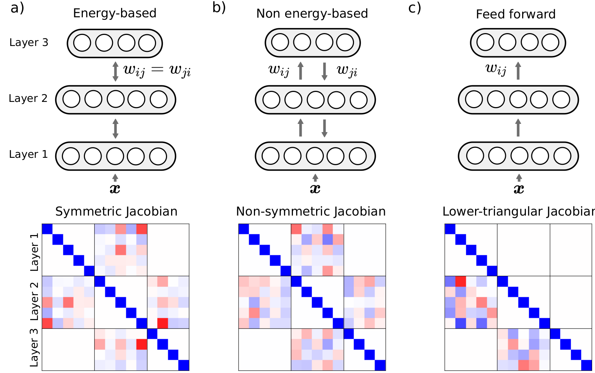

# Improving equilibrium propagation without weight symmetry through Jacobian homeostasis
 
This repository contains the code to reproduce the paper.



## Installing the environment

All the simulations use 
[Jax](https://github.com/google/jax), 
[Flax](https://github.com/google/flax), 
[TensorFlow](https://github.com/tensorflow/tensorflow), and 
[TensorFlow Datasets](https://www.tensorflow.org/datasets?hl=en).
To install the environment with the latest Jax/Jaxlib (requires python>=3.7): 

```
python3 -m venv holo_vf
source holo_vf/bin/activate
pip install --upgrade pip setuptools
pip install --upgrade "jax[cuda11_pip]" -f https://storage.googleapis.com/jax-releases/jax_cuda_releases.html
pip install flax
pip install tensorflow
pip install tensorflow-datasets
pip install wandb
pip install jupyter
pip install matplotlib
```
Additionally, you need to be logged in wandb, so run `wandb login` and enter 
your private token.

## Reproducing

The command lines to reproduce the simulations are in the `run.sh` file.
Logging is done with weight and biases, so **make sure to edit line 60 of the
train script with your account infos**.
